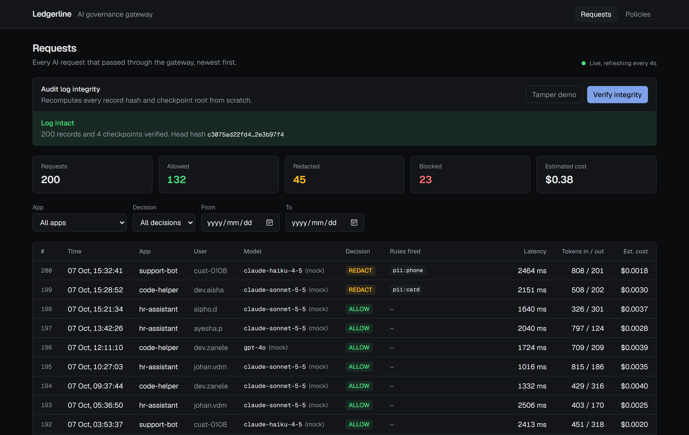
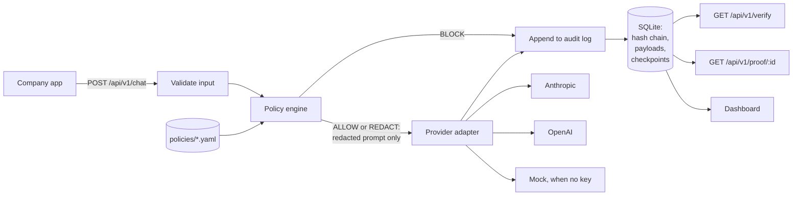
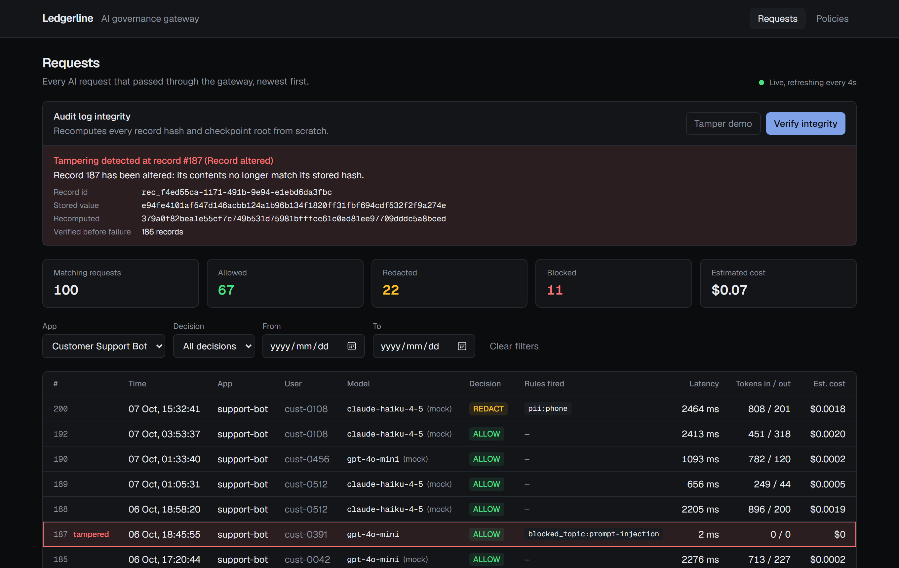
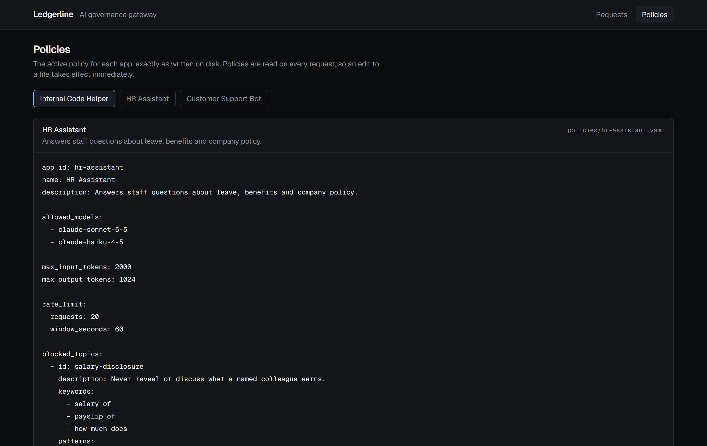

# Ledgerline

An AI governance gateway. It sits between a company's apps and its LLM
providers, checks every request against a policy, and writes each one to an
audit log that can later prove it has not been altered.



## The problem

Once a company has more than one team calling LLM APIs, three questions get
hard to answer:

1. **What are we sending?** Staff paste ID numbers, card numbers and customer
   emails into prompts, and those leave the building.
2. **Who is allowed to do what?** Which apps may use which models, on which
   topics, and how often.
3. **Can we prove it afterwards?** An ordinary log table can be edited by anyone
   with database access, so it is weak evidence in an audit or a dispute.

Ledgerline answers all three at one choke point.

## What it does

- **Gateway.** `POST /api/v1/chat` accepts `{ app_id, user_id, messages, model }`
  and forwards it to Anthropic or OpenAI through a provider adapter. With no API
  key set it answers from a built-in mock, so the demo needs zero setup.
- **Policy engine.** Each app has a YAML policy: allowed models, token limits, a
  per-user rate limit, blocked topics, and PII types to redact (emails, phone
  numbers, South African ID numbers, card numbers). Every request gets a decision
  of `ALLOW`, `REDACT` or `BLOCK`, with the rules that fired. Redaction happens
  before the prompt leaves the gateway.
- **Verifiable audit log.** Every request is appended to a SHA-256 hash chain in
  SQLite. Every 50 records a Merkle root is saved as a checkpoint.
  `GET /api/v1/verify` re-checks the whole log and names the exact record where
  tampering is found. `GET /api/v1/proof/:recordId` returns a Merkle inclusion
  proof for one record.
- **Dashboard.** A live request table with filters, a "Verify integrity" button,
  a development-only "Tamper demo" button, and a viewer for the active policies.

## 60-second quickstart

Requires Node.js 22 or newer. No accounts, keys or paid services.

```bash
npm install && npm run seed && npm run dev
```

Open http://localhost:3000. Then:

1. Press **Verify integrity**. The log of 200 seeded requests passes.
2. Press **Tamper demo**. One record is edited directly in the database file,
   bypassing the gateway.
3. Press **Verify integrity** again. The check fails and points at that record.
4. Run `npm run seed` to get a clean log back.

Send your own request:

```bash
curl -X POST http://localhost:3000/api/v1/chat \
  -H "content-type: application/json" \
  -d '{"app_id":"hr-assistant","user_id":"demo","model":"claude-sonnet-5-5","messages":[{"role":"user","content":"My email is thandi@example.co.za. How much leave do I have?"}]}'
```

The response shows `"decision": "REDACT"`, and the mock's reply echoes the prompt
it received, with the email already replaced by `[REDACTED_EMAIL]`.

To use real models, copy `.env.example` to `.env.local` and add a key.

Other commands: `npm test` (113 tests), `npm run typecheck`, `npm run lint`,
`npm run build`.

## Architecture



| Path | What lives there |
|---|---|
| `src/lib/providers/` | The `ProviderAdapter` interface and its Anthropic, OpenAI and mock implementations. Adding a provider is one class and one registry line. |
| `src/lib/policy/` | Policy schema, YAML loader, PII redactor, and `evaluatePolicy`, a pure function with no I/O. |
| `src/lib/audit/` | Canonical JSON, the hash chain, Merkle trees, verification and proofs. |
| `src/lib/gateway.ts` | The request lifecycle that ties the three together. |
| `src/app/api/v1/` | Thin route handlers. |
| `src/components/` | Dashboard UI. |
| `policies/` | One YAML policy per app. |
| `scripts/seed.ts` | Demo traffic, sent through the real pipeline. |

### Data model

- **`audit_records`**: one row per request. Holds who, what model, the decision,
  the rules fired, token counts, cost, latency, three hashes (original prompt,
  redacted prompt, response), the previous record's hash and this record's hash.
- **`record_payloads`**: the readable redacted prompt and the response text.
  Deliberately outside the hash chain.
- **`checkpoints`**: a Merkle root for each batch of 50 records.

The original, unredacted prompt is never written to disk. Only its hash is.

## How verification works, in plain language

**The hash chain.** A hash is a fingerprint of some data: change one character
and the fingerprint changes completely. Each audit record stores a fingerprint
of its own contents together with the fingerprint of the record before it. That
links the records like a chain. If someone edits record 137, its fingerprint no
longer matches. If they also fix that fingerprint, record 138 no longer points
at the right value. Verification walks the chain from the start, recomputes
every fingerprint from the stored data, and stops at the first one that is wrong.

**Hashes instead of text.** The chain contains fingerprints of the prompt and
response, not the text. So the log can prove what was said (give it the text
and it can confirm the fingerprint matches) without the chain itself exposing
anything. It also means the readable text can be deleted later, for example for
a data-erasure request, and the chain still verifies.

**Merkle checkpoints.** Every 50 records, the 50 fingerprints are combined in
pairs, then the results are paired again, until one fingerprint is left. That
is the Merkle root, a single short value that commits to all 50 records. Two
things follow:

- *Proofs.* To prove one record is in a batch you need only that record and 6
  other fingerprints, not the other 49 records. `GET /api/v1/proof/:recordId`
  returns exactly that, and anyone holding the root can check it without access
  to the database.
- *A second line of defence.* If an attacker edits a record and carefully
  recomputes every fingerprint after it, the chain looks consistent again, but
  the checkpoint root saved before the edit no longer matches.



### What verification can and cannot prove

It detects, and locates: an edited record, a deleted record, a forged hash, a
rewritten chain under a checkpoint, a truncated log, an edited checkpoint and
edited prompt or response text. Each of these has a test in `tests/tamper.test.ts`.

It **cannot** detect an attacker with full write access who rewrites the record,
every hash after it, *and* the checkpoint roots. Nothing stored only in the
database can, because they can rewrite all of it. Two tests assert this limit
so that it is documented and not hidden. The fix is to publish each checkpoint
root somewhere the attacker cannot write, such as a public blockchain or a
transparency log. The `anchor_tx_hash` column exists for that and is unused.

## API

| Endpoint | Purpose |
|---|---|
| `POST /api/v1/chat` | Run a request through policy, provider and audit log. 200 for ALLOW or REDACT, 403 for BLOCK, 429 for a rate-limit BLOCK. |
| `GET /api/v1/verify` | Check the whole log. Returns `ok: true`, or the failure type, record number, stored value and recomputed value. |
| `GET /api/v1/proof/:recordId` | Merkle inclusion proof, or `status: "pending"` if the record's batch has no checkpoint yet. |
| `GET /api/v1/records` | Dashboard feed. Filters: `app`, `decision`, `from`, `to`, `limit`, `offset`. |
| `GET /api/v1/policies` | Active policies with their raw YAML. |
| `POST /api/v1/dev/tamper` | Development only. Edits one record with raw SQL. Returns 404 in production. |

Every error has the shape `{ "error": { "code", "message", "details" } }`.



## Docker

```bash
docker build -t ledgerline .
docker run -p 3000:3000 ledgerline sh -c "npm run seed && npm run start"
```

The container runs in production mode, so the tamper demo is disabled.
**This Dockerfile has not been built or run**; Docker was not available on the
machine this was developed on.

## Tradeoffs

- **Keyword and regex topic blocking, not an LLM classifier.** Decisions are
  deterministic, free and unit-testable, and every block can be explained by
  pointing at a rule. The cost is that rephrasing gets around it.
- **PII detection is pattern-based and tuned for South African formats.** Card
  and ID numbers are checksum-validated to cut false positives. Names, addresses
  and phone numbers without a leading `0` or `+` are not detected.
- **SQLite and a synchronous driver.** Appending is one `IMMEDIATE` transaction,
  so the chain cannot fork, and there is nothing to install. It also means one
  writer at a time and one machine.
- **Rate limits are counted from the audit log.** They survive restarts and
  need no extra store, but the count and the insert are not atomic across the
  provider call, so a burst of simultaneous requests can slightly exceed a limit.
- **No streaming.** Responses are hashed whole.
- **No authentication on the gateway.** `app_id` and `user_id` are trusted as
  sent. This is the first thing to fix before real use.
- **Unknown apps are rejected without a log entry**, because there is no policy
  to record a decision against.
- **Policies are re-read on every request.** Simple and instantly live, but the
  log does not record which version of a policy made a decision.
- **Token counts are estimates in mock mode** (about four characters per token),
  and cost uses a hard-coded price table.
- **Real provider calls are untested.** The Anthropic and OpenAI adapters are
  type-checked against the official SDKs but were never run against a live API.

## What I would do next for production

1. **Anchor checkpoint roots externally**, for example to Base Sepolia through a
   small contract, and show the transaction in the dashboard. This closes the
   one gap verification cannot close on its own.
2. **Authenticate callers** with per-app API keys, so `app_id` cannot be spoofed.
3. **Record the policy hash on each audit record**, so a decision can be tied to
   the exact policy version that produced it.
4. **Move to Postgres** with an advisory lock around the append, to support
   several gateway instances.
5. **Streaming**, hashing the response incrementally as it passes through.
6. **Scan responses too**, not only prompts, for PII and policy violations.
7. **Salt the prompt hashes.** A short, guessable prompt can be recovered from
   an unsalted hash by trying candidates.
8. **Incremental verification** from the last trusted checkpoint, so a check
   does not have to walk the whole log.

## How this was built

With an AI coding agent, one feature per commit, tests run after each.
[BUILD_LOG.md](BUILD_LOG.md) records what was asked for in each phase, what went
wrong, how it was caught and what changed.
